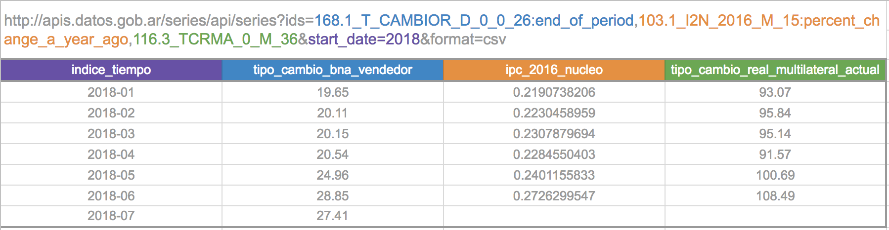

# Series de Tiempo

## Series de Tiempo en la APN

Una API REST es un servicio web que permite hacer consultas a una base de datos o aplicación en línea. Muchas APIs pueden usarse simplemente como una URL configurable / parametrizable en el navegador.

La Administración Pública Nacional dispone de APIs de datos en las que todos los organismos pueden publicar: https://apis.datos.gob.ar

Una de ellas permite consultar indicadores con evolución temporal de distintos ministerios (actualmente +20 mil series):

* **Documentación API**: https://apis.datos.gob.ar/series
* **Buscador web de series**: http://datos.gob.ar/series (permite buscar los ids de las series deseadas)

El buscador permite llevarse una URL a la API que descarga un CSV actualizado de los indicadores elegidos:

* **Tipo de cambio vendedor BNA**: http://apis.datos.gob.ar/series/api/series/?limit=1000&ids=168.1_T_CAMBIOR_D_0_0_26&format=csv
* **IPC Nacional. Nivel General**: http://apis.datos.gob.ar/series/api/series/?limit=1000&ids=148.3_INIVELNAL_DICI_M_26&format=csv
* **EMAE**: http://apis.datos.gob.ar/series/api/series/?limit=1000&ids=143.3_NO_PR_2004_A_21&format=csv

Como te podrás imaginar, `limit`, `ids` y `format` son algunos de esos parámetros que te permiten personalizar la consulta:

* `ids`: el parámetro más importante! Permite pedir una lista de series por id, separados por comas.
* `format`: puede ser "csv" o "json".
* `limit`: por default la API devuelve 100 filas, pero se puede extender hasta 1000.

En la mayoría de las APIs REST, los parámetros empiezan después del `?` y se separan por `&`.

## Time series dataframes

### Descargar CSVs de la API de series de tiempo

a. Descargar el IPC en un dataframe de R. Hint: `df = read.csv(*)` 

b. Descargar el Estimador Mensual de la Actividad Económica (EMAE) general, de la Construcción y de la Industria Manufacturera en el mismo dataframe. Hint: `ids=*,*,*.` 

c. Descargar el tipo de cambio mínimo, promedio y máximo mensual, usando la API (sin programar para eso en R). Hint: `&collapse=month` transforma la llamada en "mensual" y `&ids=*:min,*:avg` indica cómo agregar los valores de esas series.

d. Descargar el IPC, la inflación mensual y la inflación inter-anual en un mismo dataframe, usando la API (sin programar para eso en R) sólo desde 2017 en adelante. Hint: `&ids=*:percent_change,*:percent_change_a_year_ago` / `&start_date=*`.

### Convertir el dataframe en uno de series de tiempo

a. Plotear la relación entre la inflación mensual y las expectativas de inflación futura. Hint: `plot(df$*, df$*)` 

b. ¿Tal vez las expectativas de inflación futura inciden con un mes de retraso en la inflación mensual real? Para esto hace falta comparar una regresión entre las dos variables, contra una en la que las expectativas están 1 mes adelantadas. Esto requiere tratar las variables como series de tiempo.
    
    b1. install.packages("dynlm"); library("dynlm") (Instala y carga una librería de regresión para series de tiempo)
    b2. library(zoo); df_ts = read.zoo(df, index = 1, tz = "", format = "%Y-%m-%d") (Lee la primer columna como un índice de tiempo con "zoo")
    b3. Regresar la inflación mensual contra las expectativas de inflación futura. Hint: summary(dynlm(df_ts$* ~ df_ts$*))
    b3. Regresar la inflación mensual contra las expectativas de inflación futura desfasadas 1 mes antes. Hint: summary(dynlm(df_ts$* ~ lag(df_ts$*, -1))).
    b4. Comparar los R2 de cada regresión. ¿Mejoró el % de variabilidad de la inflación mensual explicado?

# LASSO

Sin embargo, la inflación es un fenómeno multicausal. Probablemente el mejor modelo explicativo sea uno que incluya muchas variables... La base de series de tiempo ofrece 20 mil! Si bien no tiene sentido probar con todas, habría que buscar un método que elija el mejor modelo al enfrentarse a muchas variables. (Ver tutorial de LASSO en R para más detalles: https://web.stanford.edu/~hastie/glmnet/glmnet_alpha.html )

a. Cargar en un dataframe de series de tiempo la inflación mensual, la tasa de interés, la variación mensual del tipo de cambio nominal, las expectativas de inflación futura y el tipo de cambio real multilateral, desde 2017. Hint: `df2 = read.csv("https://apis.datos.gob.ar/series/api/series/?limit=1000&ids=*:percent_change,*,*:percent_change,*,*&format=csv&start_date=2017")` 

b. Usar el método lasso (librería `glmnet`) para encontrar el mejor modelo posible entre estas variables.

    b1. install.packages("glmnet", repos = "http://cran.us.r-project.org"); library(glmnet)  (Instala y carga glmnet)
    b2. Remover las filas que tengan algún valor nulo. Hint: * = *[complete.cases(*), ]
    b3. Crear una matriz de predictores x (sin la variable a predecir). Hint: x = data.matrix(subset(*, select=c("*", "*", "*")))
    b4. Correr lasso usando cross validation. Hint: cvfit = cv.glmnet(x, y)
    b5. Encontrar los coeficientes del modelo que minimiza el error de predicción. Hint: coef(cvfit, s = "lambda.min")

c. Comparar la predicción del modelo con la realidad en un plot. Hint: plot(y, predict(cvfit, newx = *, s = "lambda.min"))

d. Calcular el R2 de un ajuste lineal tradicional sobre este modelo y comparar los coeficientes.

Hint: `summary(lm(* ~ * + *))`
